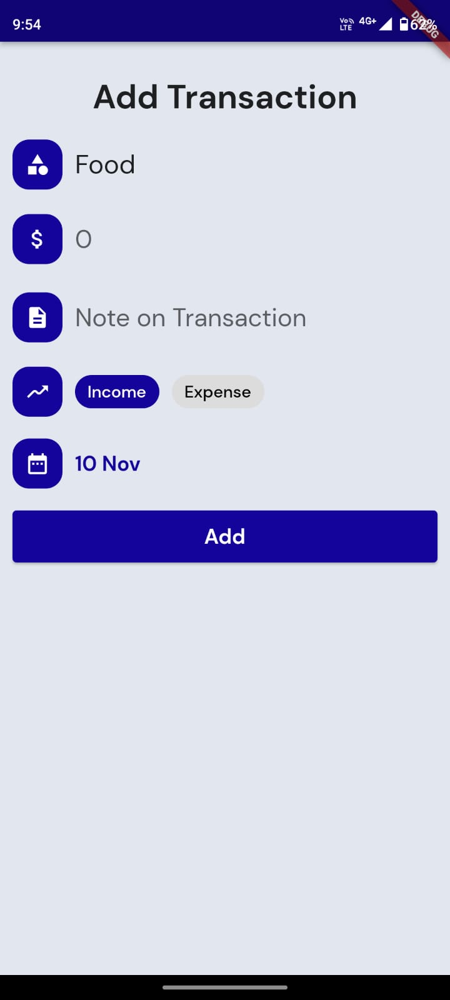

# Expense Tracker

A mobile application for tracking expenses. This app can run on Android. We have built an application which is Used to help user to track his expense in different categories.And view detailed analysis of his expenses on different categories. User can see his savings and get suggestions of his investment based on savings. User can get detailed information of single transaction.User can see category vies pie-chart , linebar chart  based on expenses.

## Features

- Track Daily expenses

- Investment suggestion

- Add new expenses

- Graphical overview of expense

- Delete an expense

## How to setup on your system :- 

#### Requirements : 
 1. Flutter
 2. Android Studio 
 3. Emulator/Real Device(Android/IOS)

#### How to install : 

1. Check the Official Docs link for installing Flutter : https://flutter.dev/docs/get-started/install 
2. Installing Android Studio & setup : https://youtu.be/InigFUSiPl8
3. How to setup the emulator on android studio : https://developer.android.com/studio/run/emulator 
4. or, connect a physical device : https://stackoverflow.com/questions/54444538/how-do-i-run-test-my-flutter-app-on-a-real-device

## Getting Started

Follow these instructions to build and run the project

### Setup Flutter

A detailed guide for multiple platforms setup could be find [here](https://flutter.dev/docs/get-started/install/)

### Setup Project

- Clone this repository using `git clone https://github.com/tejasdobariya/SDP_Project.git`.
- `flutter pub get` to get all the dependencies.
- <pre>
      flutter clean 
      flutter pub get 
      flutter pub upgrade 
      flutter run
    </pre>

## Screenshots

### Created By:-
1) [Tejas Dobariya (CE035)](https://github.com/tejasdobariya/)
2) [Smit Dhameliya (CE031)](https://github.com/smitdhameliya1/)

